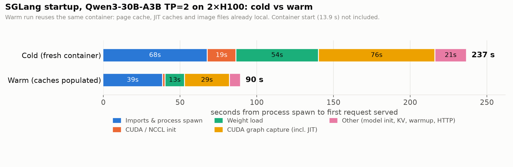
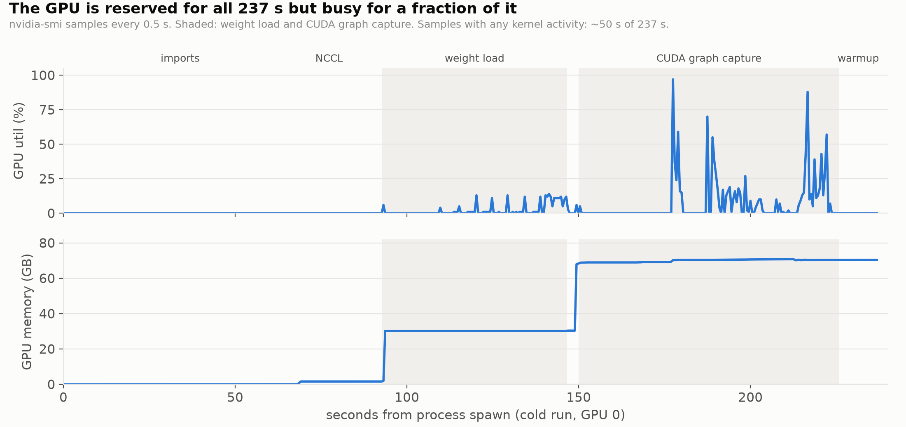

# Fast Engine Startup — Baseline: Where Does Startup Time Go?

**Setup:** Qwen/Qwen3-30B-A3B-Instruct-2507 (BF16, 61 GB), SGLang v0.5.20 (`lmsysorg/sglang:v0.5.20`, torch 2.13 / CUDA 13), TP=2 on 2× H100 80GB HBM3 (Modal, driver 580.95), weights on a Modal v2 volume. Vanilla `sglang.launch_server` with no startup flags.

**Method:** One Modal container launches the engine twice in a row (`baseline.py`, run `20260923-184715`).
- **Cold (run 1):** fresh container. Empty page cache, empty JIT caches, and image files not yet fetched.
- **Warm (run 2):** same container right after run 1. Everything above is cached.

Phase boundaries come from SGLang's own log lines, timestamped as each line arrives. "Ready" means `/health` returned 200 and one `/generate` request succeeded. GPU utilization and memory were sampled every 0.5 s.

> Caveat: this is n=1 per condition. The numbers show where time goes, but they are not yet tight enough to quote precisely. Repeat runs are listed under next steps.

## Headline

| | Cold | Warm | Cold − Warm |
|---|---:|---:|---:|
| Container start (call → function running) | 13.9 s | — | |
| Process spawn → serving first request | **237.0 s** | **89.7 s** | 147.3 s |
| **End to end** | **~251 s** | | |

Nearly **two-thirds of cold startup (147 s of 237 s) disappears when caches are warm.** Most of the gap is fixable by preparing things before the GPU is attached, not by making SGLang itself faster.



## Phase breakdown (seconds)

| Phase | Cold | Warm | Δ | What it is |
|---|---:|---:|---:|---|
| Spawn → `server_args` logged | 45.8 | 18.8 | 27.0 | Python + torch + sglang imports in the launcher; the cold run also fetches image files lazily |
| → `Init torch distributed begin` | 22.2 | 20.1 | 2.1 | Spawning the TP worker processes, which re-import torch/sglang |
| Distributed / NCCL init | 18.7 | 0.8 | 17.9 | NCCL + CUDA context setup; cold includes first load of CUDA/NCCL libraries |
| → `Load weight begin` | 6.1 | 2.0 | 4.1 | Model construction |
| **Weight load** | **53.8** | **12.8** | **41.0** | 61 GB from the volume (28.65 GB per GPU). Cold ≈ 1.1 GB/s; warm is served from page cache |
| KV cache allocation | 2.4 | 2.0 | 0.4 | 777k tokens, 35.6 GB K+V per GPU |
| **Prefill CUDA graph capture** | **62.6** | **20.0** | **42.6** | "Breakable" piecewise graphs over **58** token counts (4 … 8192); cold includes Triton JIT for the MoE kernels |
| Decode CUDA graph capture | 13.3 | 9.3 | 4.0 | Full graphs over batch sizes 1 … 256+ |
| Scheduler → Uvicorn up | 1.3 | 0.6 | | |
| Server warmup request | 8.8 | 1.2 | 7.6 | SGLang's built-in warmup `/generate` |
| Health + first request | 1.1 | 1.0 | | The first user request takes 70–80 ms once ready |

SGLang's own `Engine startup timings` line agrees with these numbers: load_weight=53.77, cuda_graph prefill=62.59 / decode=13.32 cold.

## GPU time wasted during startup

During the cold launch, the 2 GPUs were reserved (and billed) for the whole 237 s:

- GPU memory was held for **167 s**.
- Any kernel activity at all showed up in only **~50 s of samples (~21%)**.
- During weight loading, the GPUs showed activity in only 22 of 54 s. They mostly wait on storage.



The timeline also shows **the first ~27 s of CUDA graph capture (150–177 s) with 0% GPU utilization**. That's Triton JIT-compiling the MoE kernels on the CPU while both GPUs wait, which matches the 42.6 s cold/warm gap in prefill capture.

This is coarse (nvidia-smi `utilization.gpu` counts any kernel in the sample window), but the conclusion holds: **most of cold startup is CPU, I/O and compile work that doesn't need the GPU.** That supports moving preparation onto CPU workers before the GPU is attached.

## What this says about where to go deeper

Ranked by recoverable time, with the approach each points to:

1. **Weight loading: ~41 s recoverable (cold 53.8 → warm 12.8).** Reading from the volume is the bottleneck, not the host-to-GPU copy. Candidates:
   - Pre-stage weights to local NVMe or `/dev/shm` on a CPU worker before GPUs attach.
   - Parallel/streaming loaders already in this SGLang build: `--load-format fastsafetensors` and `runai_streamer`.
   - For the "A serving, B starting" scenario: `--load-format remote_instance`, which pulls weights GPU-to-GPU from the serving replica (NIXL is installed).

   Trade-offs: local disk or RAM per node, and the load that remote transfer puts on the serving replica.

2. **CUDA graph capture: ~43 s JIT + ~29 s capture.**
   - The cold/warm gap (42.6 s on prefill graphs) is compile work. Persisting JIT/compiler caches across containers, keyed by model, TP, GPU type and SGLang version, should recover most of it.
     - *Open question:* after run 1, `~/.cache` held only 20 MB (`~/.cache/sglang`), so the Triton/Inductor caches must live somewhere I haven't found yet. Locating them comes first.
   - The remaining ~29 s warm is capture itself, over 58 prefill sizes plus the decode batch sizes. Capturing fewer sizes (`--cuda-graph-max-bs`, custom lists) or capturing lazily trades startup time for latency on uncaptured shapes.

3. **Process start and imports: ~68 s cold / ~39 s warm before any model work.**
   - Three Python processes (launcher + 2 TP workers) each import torch and sglang.
   - The cold premium (~27 s) comes from lazy image loading.
   - Candidates: Modal memory snapshots, pre-warming the image, or a pre-imported engine process started on CPU before GPU attach.

4. **NCCL/CUDA init: ~18 s cold, ~1 s warm.** Most likely first-time library loading from the image, so it should shrink alongside item 3.

5. **Built-in warmup: 8.8 s cold.** Mostly JIT on the first real forward pass, so it should shrink with item 2.

A rough ceiling: if everything that differs between cold and warm were prepared ahead of time, startup would approach **~90 s**. Getting below that means capturing fewer graphs, restoring from a snapshot, or reducing import cost.

## Next steps

1. Repeat cold and warm runs (n≥3) to get variance. Add a second cold container to confirm how much of the cost is per-container versus per-launch.
2. Find where the JIT artifacts are written; persist them to the volume and re-measure the cold start.
3. Weight-loading sweep, measured on cold containers: default vs. `fastsafetensors` vs. `runai_streamer` vs. pre-staged local NVMe / `/dev/shm`.
4. Graph capture sweep: default vs. reduced batch-size lists vs. `--disable-cuda-graph`, including decode throughput and latency after startup so the trade-off is visible.
5. 4×H100 scenario: A (GPUs 0–1) serving while B (GPUs 2–3) starts with `remote_instance` loading from A. Measure B's startup and A's latency impact.

## Reproduce

```bash
uv run modal run tmp/experiments/setup_env.py::download_model   # once, CPU only
uv run modal run tmp/experiments/baseline.py --runs 2            # ~6 min on 2×H100
```

Raw logs, `gpu.csv` and `summary.json` are in `results/20260923-184715/` (and on the `fes-results` volume).
